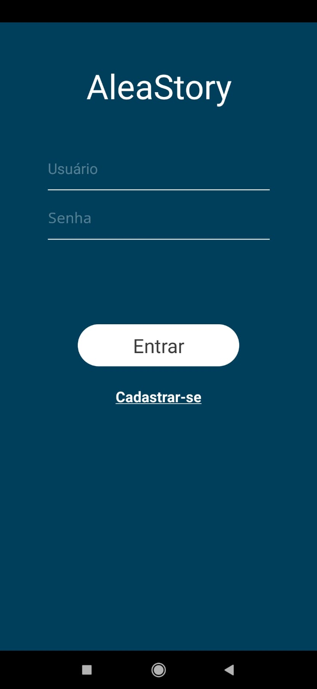
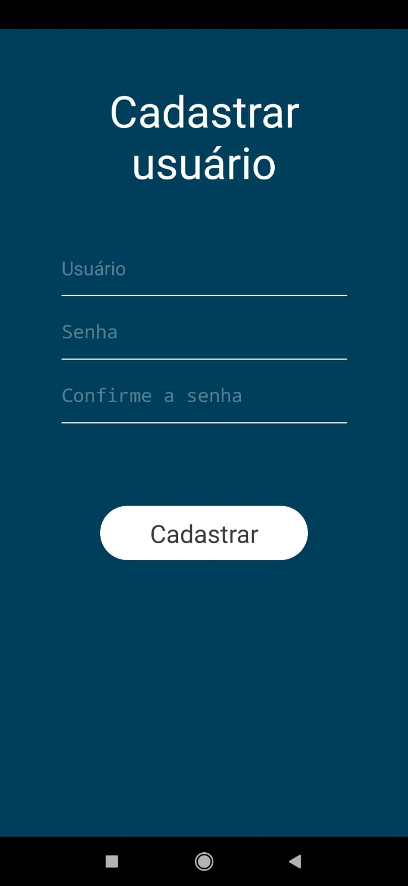
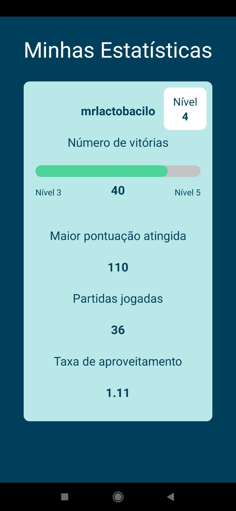
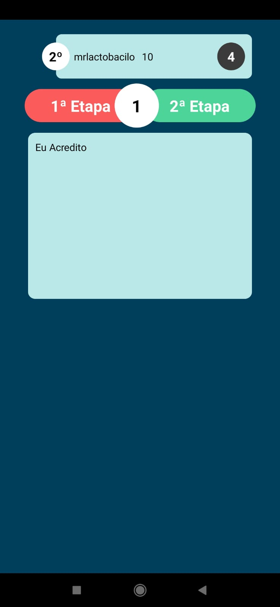

🇧🇷 [Versão em português](./README.pt-br.md)

# AleaStory
AleaStory is a game developed by myself using the React Native stack for a colege discipline (Computational Systems Projects Development I and II). The main objective in the game is create a funny text with random words sent by each player connected, voted by themselfs and scoring the most voted words.

How work the game:

In a overview, the player will join in a virtual room, where will meet another connected players. Each game has three stages:
- **First**: each player has some seconds to send one single word to the vote stage - the player must send a word which he believes to fit better in the current sentence (except for the first round), or that make the text more funny;
- **Second**: the players must to vote in the words that they believes to fit better in the current sentence (is not possible to vote in you own sent word, of course);
- **Third**: the most voted word is added to the current sentence, and the player who sent it will score.

When the timer goes out, the game is finished and the player with high score wins, plus the full history/text generated by the players is shown in the screen.

An APK file for the game is avaliable in the directory `/apks`.

   

  
