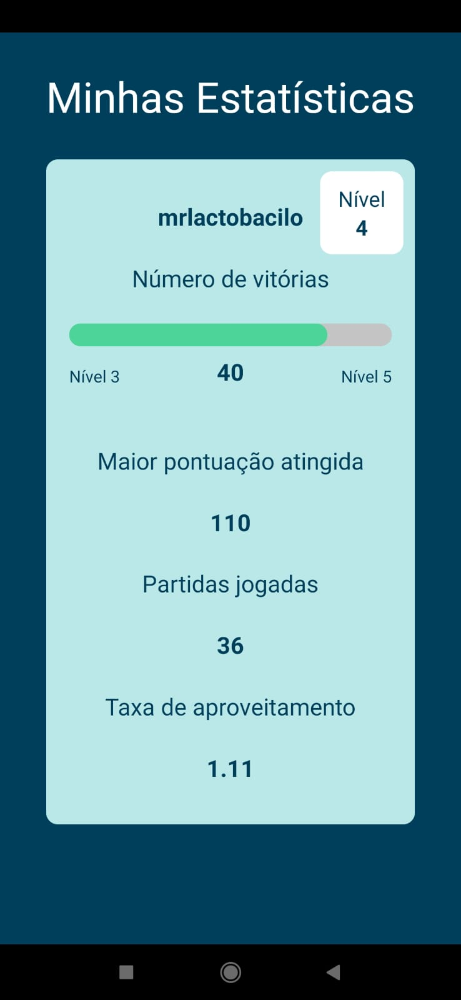
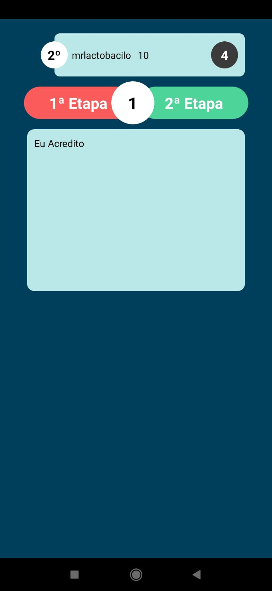

# aleastory

AleaStory é um jogo desenvolvido por mim em React Native (aplicativo mobile) e NodeJs (backend) como projeto das disciplinas Desenvolvimento de Projetos de Sistemas Computacionais (I e II). O objetivo geral do jogo é criar um texto divertido com palavras aleatórias que serão enviadas por cada jogador e votadas pelos mesmos, ganhando pontos os responsáveis pelas mais votadas.

Como o jogo funciona:

Resumidamente, o jogador entrará em uma "sala" virtual, onde será possível se reunir com outros jogadores para jogar a partida. Cada partida será composta de três etapas:
- **Primeira**: cada jogador tem alguns segundos para submeter uma única palavra para votação – que ele acredite se encaixar melhor no texto já escrito (com exceção da - primeira rodada),  ou que apenas deixe o mesmo mais engraçado.
- **Segunda**: jogadores votam nas palavras que acreditam se encaixar melhor no texto (não se pode votar na própria palavra, logicamente)
- **Terceira**: palavra mais votada é adicionada ao texto, e o jogador responsável por seu envio ganha pontos.

Uma versão do arquivo APK está disponível na pasta `/apks`

Quando a partida acabar, o jogador com mais pontos acumulados ganha o jogo, além de ser exibido na tela a história gerada pelos participantes.

   

  
